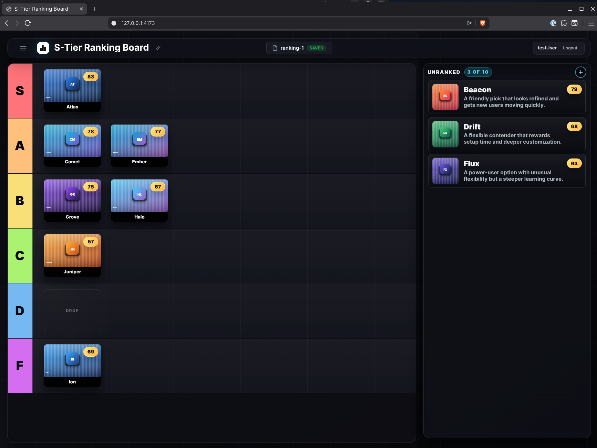
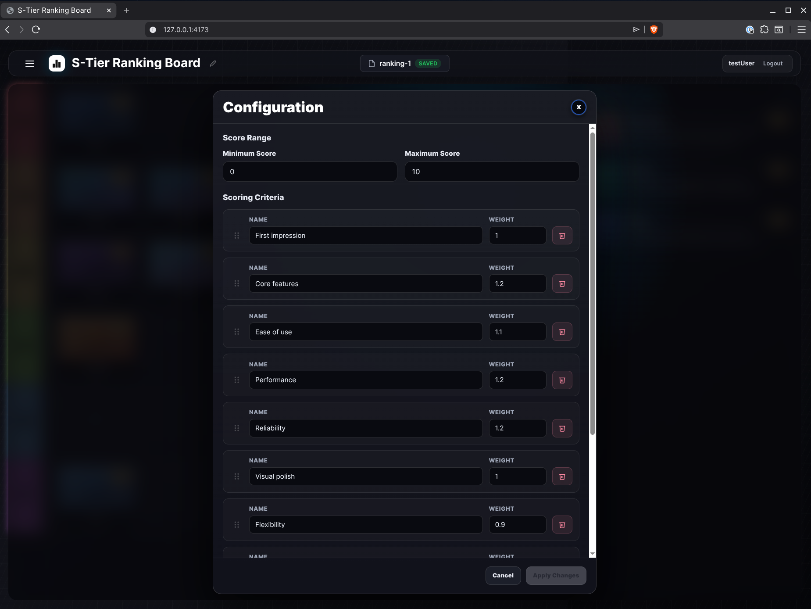

# Tier Ranking App

A browser-based app for ranking candidates into tiers using weighted scoring criteria. Drag candidates between tiers, score them against a custom rubric, and manage multiple saved rankings.



## Features

- **User authentication** — Sign up and log in with per-user accounts. Each user's rankings and data are completely isolated.
- **Tier ranking** — Drag-and-drop candidates into configurable tier lanes (S, A, B, C, D, F, etc.)
- **Weighted scoring** — Score candidates against a custom rubric with adjustable weights and score ranges
- **Rank display** — Overall weighted scores with rank and tie detection
- **Candidate management** — Add, edit, and delete candidates with image upload
- **Multiple rankings** — Save, load, export, import, and delete named rankings
- **In-browser configuration** — Edit tiers, scoring criteria, and score ranges without touching config files
- **Auto-save** — Changes are saved automatically as you work

## Self-Hosted Deployment

Deploy on your local machine, or a remote server, using the pre-built image, via Docker. Create a directory with a `compose.yml` and the required data volumes:

```sh
mkdir tier-ranking-app && cd tier-ranking-app
mkdir -p data/candidates
```

Create `compose.yml`:

```yaml
services:
  tier-ranking-app:
    image: ghcr.io/warkstee/tier-ranking-app:latest
    build: .
    ports:
      - "4173:80"
    volumes:
      - ./data/candidates:/usr/share/nginx/html/assets/candidates
      - db-data:/app/data
    environment:
      - DB_PATH=/app/data/tier-ranking.db
    restart: unless-stopped

volumes:
  db-data:
```

Then start the container:

```sh
docker compose up -d
```

Open `http://127.0.0.1:4173/` (local machine) / `http://<server-ip>:4173/` (remote server)

To update to a newer version:

```sh
docker compose pull
docker compose up -d
```

Make sure the port `4173` has been opened in the firewall

## Configuration

The app ships with a default configuration. Open the menu (burger icon, top-left) to:

| Action | Description |
|--------|-------------|
| **Edit Criteria** | Add, remove, and reorder scoring facets. Set weights and the score range (min/max). |
| **Edit Tiers** | Add, remove, and reorder tier lanes. |
| **Reset Scores & Rankings** | Reset all scores and move candidates back to the unranked pool. |

Changes are applied immediately and saved to the current ranking.



## Ranking Management

Use the **File** menu (burger icon, top-left) to manage rankings:

| Action | Description |
|--------|-------------|
| **New Ranking** | Start a fresh ranking with default tiers. Prompts for a name. |
| **Open** | Browse and load any saved ranking. |
| **Save** | Save changes to the current ranking. |
| **Save As** | Save the current ranking under a new name. |
| **Download File** | Download a ZIP containing the ranking data and all candidate images. |
| **Upload File** | Load a ranking from a previously exported ZIP file. |
| **Delete File** | Remove a saved ranking. |

Rankings auto-save after any change. If no name has been set, they save as "untitled".

